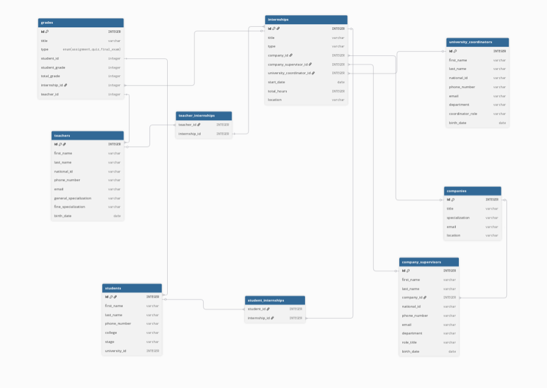

# Design Document

By Ahmed Saad

Video overview: <URL HERE>

## Scope

The purpose of this database is to manage internship programs between companies, universities, students, and teachers. It provides a centralized system for organizing internships, assigning supervisors and teachers, registering students, and recording student grades throughout the internship.

The database includes the following entities:
- Students
- Teachers
- Companies
- Company Supervisors
- University Coordinators
- Internships
- Student Enrollments
- Teacher Assignments
- Grades
- Audit Log

The database doesn't include:
- Authentication
- Attendance Tracking
- Internship Apllications Before Acceptance
- File Submissions For Assignments, Or Communication Features Such As Messaging Or Notifications.
These features are considered outside the scope of this project.

## Functional Requirements

The database allows users to:
- View available internships.
- Register students in internships.
- Withdraw students from internships.
- Assign teachers to internships.
- Assign company supervisors to inernships.
- Assign university coordinators to inernships.
- Record assignment, quiz, and final exam grades.
- View all grades for a student.
- Calculate student averages.
- View statistics about internships and student enrollment.
- Track grade modifications using audit logs.

The database isn't intended to:
- manage user accounts, permissions, internship applications, assignment files, attendance records.
- communication between users.

## Representation

### Entities

The database contains the following entities:

#### Students

Represents university students participating in internships.

Attributes:
- id
- first_name
- last_name
- phone_number
- college
- stage
- university_id

Constraints:
- Primary key on `id`
- Unique constraints on `phone_number` and `university_id`
- CHECK constraint ensures `stage` is between 1 and 7.

---

#### Teachers

Represents university teachers responsible for evaluating students.

Attributes:
- id
- first_name
- last_name
- national_id
- phone_number
- email
- general_specialization
- fine_specialization
- birth_date

Constraints:
- Primary key on `id`
- Unique constraints on national ID, phone number, and email
- CHECK constraints validate email format and birth date.

---

#### Companies

Represents companies offering internship opportunities.

Attributes:
- id
- title
- specialization
- email
- location

Constraints:
- Primary key on `id`
- Unique email.

---

#### Company Supervisors

Represents supervisors assigned by companies.

Attributes:
- id
- first_name
- last_name
- company_id
- national_id
- phone_number
- email
- department
- role_title
- birth_date

Each supervisor belongs to exactly one company.

---

#### University Coordinators

Represents university staff responsible for supervising internships.

Attributes:
- id
- first_name
- last_name
- national_id
- phone_number
- email
- department
- coordinator_role
- birth_date

---

#### Internships

Represents internship opportunities.

Attributes:
- id
- title
- type
- location
- company_id
- company_supervisor_id
- university_coordinator_id
- start_date
- total_hours

Each internship belongs to one company and has one company supervisor and one university coordinator.

---

#### Student_Internships

Represents the many-to-many relationship between students and internships.

Composite primary key:
- student_id
- internship_id

This prevents duplicate registrations.

---

#### Teacher_Internships

Represents the many-to-many relationship between teachers and internships.

Composite primary key:
- teacher_id
- internship_id

---

#### Grades

Stores assignments, quizzes, and final exams.

Attributes:
- id
- title
- type
- student_id
- student_grade
- total_grade
- internship_id
- teacher_id

The `type` field distinguishes between assignments, quizzes, and final exams instead of creating separate tables.

CHECK constraints ensure:
- valid grade type
- grades cannot be negative
- student grade cannot exceed total grade.

---

#### Audit Log

Stores every insert, update, and delete operation performed on the Grades table.

Attributes:
- id
- grade_id
- action
- action_date
- student_id
- teacher_id

This table is automatically maintained using database triggers.

### Relationships

The following Entity Relationship Diagram (ERD) illustrate the database schema and the relationships between all entities.

The database contains the following relationships:
- One company offers many internships.
- One company has many company supervisors.
- One company supervisor manages many internships.
- One university coordinator supervises many internships.
- One internship has many students.
- One student may participate in many interships.
- One internship may have many teachers.
- One teacher may teach many internships.
- One student receives many grades.
- One teacher records many grades.
- One internship contains many grades.
The Entity Relationship Diagram (ERD) is included in 'ERD.dbml'.

## Optimizations

To improve performance and simplify queries, the database includes several views.

### internship_details

Combines internship information with its company, company supervisor, and university coordinator.

### student_average_grades

Calculates each student's average grade and overall percentage.

### internship_statistics

Displays the number of students registered in each internship.

### grades_details

Combines grade information with the corresponding student, internship, and teacher.

The database also uses triggers to automatically create audit log records whenever grades are inserted, updated, or deleted.

SQLite automatically creates indexes for primary keys and unique constraints used throughout the schema.

## Limitations

This database is intended as a management system for internships rather than a complete learning management system.

Current limitations include:
- No authentication or user accounts.
- No role-based permissions.
- No assignment file uploads.
- No attendance tracking.
- No internship application workflow before registration.
- No messaging or notification system.
- No deadline management for assignments or exams.
- Only teachers can record grades; company supervisors cannot evaluate students.
These features could be added in future versions of the project.
